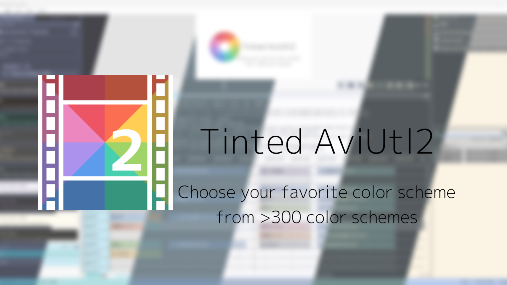
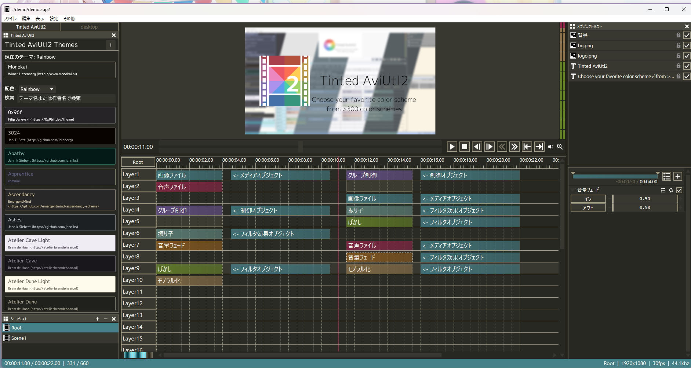
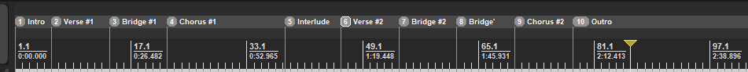

# tinted-aviutl2

[tinted-theming](https://github.com/tinted-theming/home#tinted-theming-all-your-themes-everywhere-) をAviUtl2で使うためのテンプレート。

> [!WARNING]
> 全てのテーマが見やすいとは限りません。テーマを適用した後、見づらいと感じた場合は元のテーマに戻してください。

## 配色について

2種類の配色が利用可能です。それぞれオブジェクトの色分けが異なります。

- `original`：元のAviUtl2の配色をベースにしたテーマ
- `rainbow`：オブジェクトの種類ごとに色を振りなおしたテーマ

|                       `original`                       |                      `rainbow`                       |
| :----------------------------------------------------: | :--------------------------------------------------: |
|  |  |

## 使い方

以下の2つの方法でテーマを適用できます。

### テーママネージャーを使う

#### 手動インストール

1. [Releases](https://github.com/sevenc-nanashi/tinted-aviutl2/releases/latest)から`tinted-aviutl2-v[バージョン].au2pkg.zip`をダウンロードします。
2. ダウンロードしたzipファイルをAviUtl2のプレビューウィンドウにドラッグ＆ドロップしてインストールします。
3. 「表示」->「Tinted AviUtl2」からテーマを選択して適用します。

#### AviUtl2 カタログを使う

1. [ここ](https://aviutl2-catalog-badge.sevenc7c.workers.dev/package/sevenc-nanashi.tinted-aviutl2)からAviUtl2 カタログを開きます。
2. 「インストール」ボタンをクリックしてマネージャーをインストールします。
3. 「表示」->「Tinted AviUtl2」からテーマを選択して適用します。

### 手動でテーマを適用する

1. アプリケーションデータフォルダ（「その他」->「アプリケーションデータ」->「アプリケーションデータフォルダ」）を開きます。
2. [`./themes`フォルダ](./themes)にあるテーマファイルをアプリケーションデータフォルダに`style.conf`という名前でコピーします。

## ライセンス

MIT Licenseで公開しています。テーマの著作権はそれぞれの作者に帰属します。
